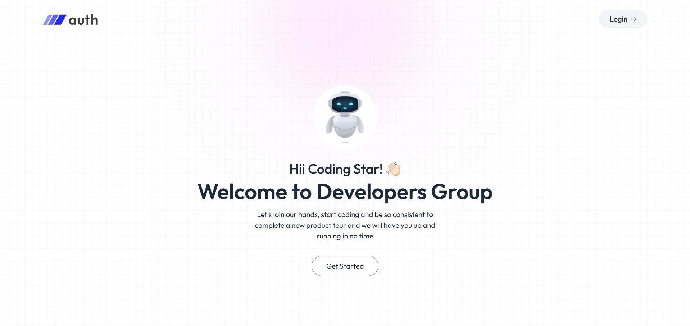
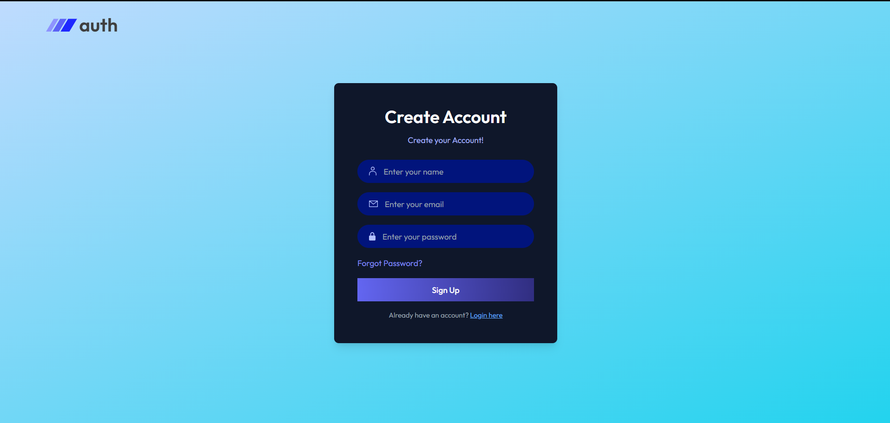
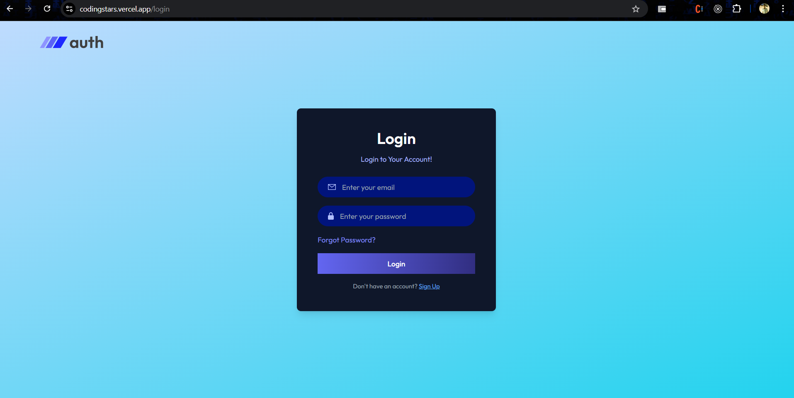
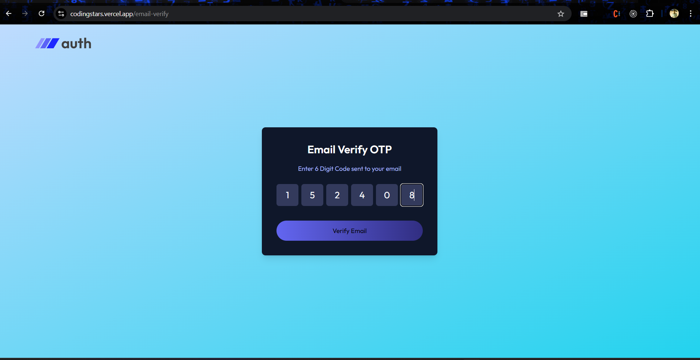
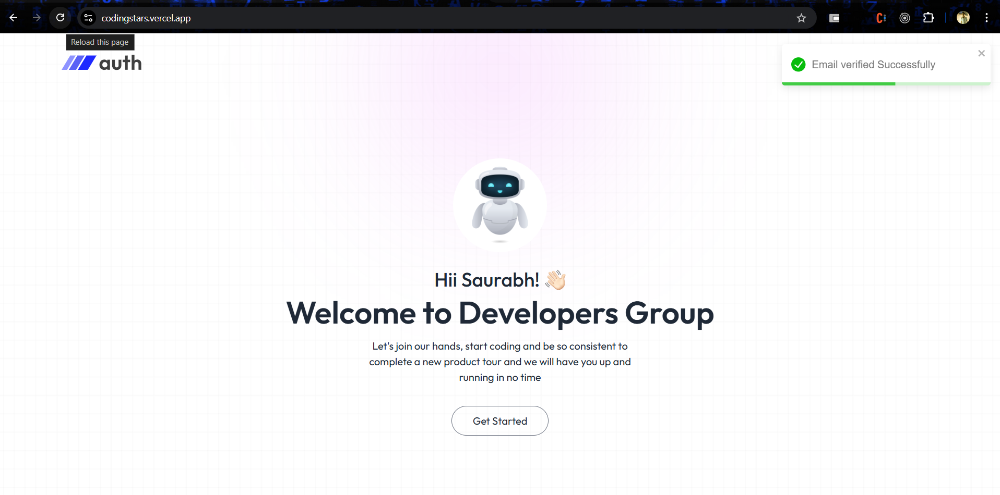
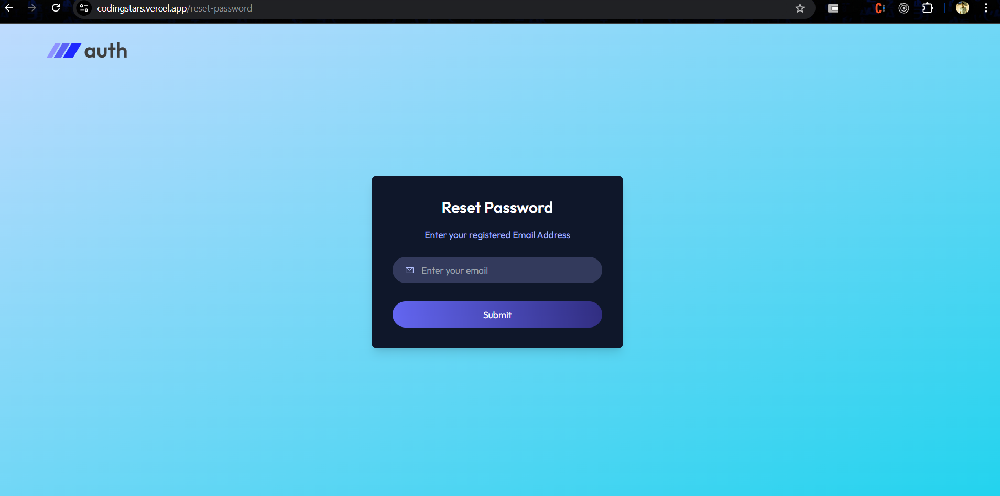

# Coding Stars

## Overview

**Coding Stars** is a robust full-stack authentication application designed to showcase modern web development practices. It features secure user registration and login, role-based access control, password recovery, and integration with third-party OAuth providers like Google and GitHub. The project is built using the MERN stack (MongoDB, Express.js, React.js, and Node.js) and follows best practices for security and scalability.

---


## Features

- **User Authentication**: 
  - Secure user registration and login.
  - JWT-based authentication with refresh tokens.



- **Role-Based Access Control**: 
  - Admin and user roles with different access levels.


- **Password Management**: 
  - Password recovery with secure email links.
  - Password hashing with bcrypt.


- **Frontend**: 
  - Responsive and interactive UI built with React and Tailwind CSS.




- **Backend**: 
  - RESTful API with Express.js and secure routes.
  - MongoDB as the database.



- **Extras**:
  - Rate limiting and IP blocking for enhanced security.
  - Comprehensive error handling and logging.
  - Unit and integration tests with Jest and Supertest.


---



## Tech Stack

| **Category**      | **Technology**                |
|-------------------|-------------------------------|
| Frontend          | React.js, Tailwind CSS        |
| Backend           | Node.js, Express.js           |
| Database          | MongoDB                       |
| Authentication    | JWT, OAuth 2.0 (Google, GitHub) |
| State Management  | Redux                         |
| Testing           | Jest, Supertest               |
| Deployment        | Vercel (Frontend), Render (Backend) |

---

## Installation and Setup

1. **Clone the Repository**:

   ```bash
   git clone https://github.com/ram8528/codingstars.git 
   cd coding-stars
   ```

2. **Install Dependencies**:

   - For Backend:
     ```bash
     cd backend
     npm install
     ```

   - For Frontend:
     ```bash
     cd ../frontend
     npm install
     ```

3. **Environment Variables**:

   Create `.env` files in both `backend` and `frontend` folders and add the following:

   **Backend `.env`**:
   ```env
   PORT=4000
   MONGO_URI=your-mongodb-uri
   JWT_SECRET=your-jwt-secret
   JWT_REFRESH_SECRET=your-refresh-token-secret
   GOOGLE_CLIENT_ID=your-google-client-id
   GOOGLE_CLIENT_SECRET=your-google-client-secret
   GITHUB_CLIENT_ID=your-github-client-id
   GITHUB_CLIENT_SECRET=your-github-client-secret
   FRONTEND_URL= https://codingstars.vercel.app/
   ```

   **Frontend `.env`**:
   ```env
   REACT_APP_BACKEND_URL=http://localhost:5000
   ```

4. **Run the Application**:

   - Start Backend:
     ```bash
     cd backend
     npm run dev
     ```

   - Start Frontend:
     ```bash
     cd ../frontend
     npm start
     ```

5. **Access the Application**:
   - Frontend: `https://codingstars.vercel.app/`
   - Backend: `https://coding-stars-nove.vercel.app/`

---

## Project Structure

```
.
├── backend
│   ├── controllers
│   ├── middlewares
│   ├── models
│   ├── routes
│   ├── utils
│   └── app.js
├── frontend
│   ├── src
│   │   ├── components
│   │   ├── pages
│   │   ├── services
│   │   ├── store
│   │   └── App.js
└── README.md
```

---

## API Endpoints

### Authentication
- `POST /api/auth/register` - Register a new user.
- `POST /api/auth/login` - Login a user.
- `POST /api/auth/logout` - Logout a user.
- `POST /api/auth/refresh-token` - Refresh JWT token.
- `POST /api/auth/password-reset` - Request password reset.
- `PUT /api/auth/password-reset/:token` - Reset password.

### User Management
- `GET /api/users` - Get all users (Admin only).
- `GET /api/users/:id` - Get user details (Admin & Owner).

---

## Deployment

1. **Frontend**:
   - Deploy to [Vercel](https://vercel.com).

2. **Backend**:
   - Deploy to [Vercel](https://vercel.com).

3. **Environment Variables**:
   - Add the same `.env` variables to your hosting platforms.

---

## Screenshots


---

## Contributions

Contributions, issues, and feature requests are welcome! Feel free to check the [issues page](https://github.com/your-username/coding-stars/issues).

---

## License

This project is licensed under the MIT License. See the LICENSE file for details.

---

## Acknowledgements

- [MongoDB](https://www.mongodb.com)
- [Express.js](https://expressjs.com)
- [React.js](https://reactjs.org)
- [Node.js](https://nodejs.org)
- [Tailwind CSS](https://tailwindcss.com)
- [OAuth Providers](https://oauth.net/2/)

---

## Contact

**Developer**: Ramdeep Kesharwani  
**Email**: [codingstars40@gmail.com](mailto:codingstars40@gmail.com)  
**GitHub**: [ram8528](https://github.com/ram8528)
